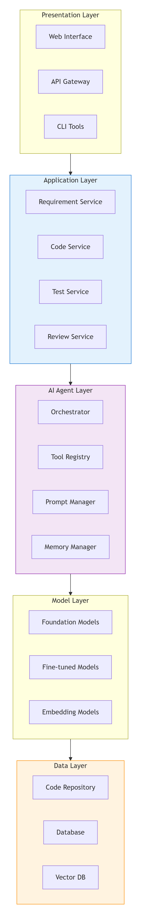
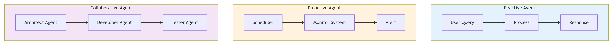

# 01 - Tổng quan về AI-Augmented SDLC

## 📌 Mục đích

Tài liệu này cung cấp cái nhìn tổng quan về việc tích hợp AI vào quy trình phát triển phần mềm (SDLC), giải thích lợi ích, thách thức và cách triển khai thực tế.

---

## 🎯 AI-Augmented SDLC là gì?

**AI-Augmented SDLC** là cách tiếp cận sử dụng trí tuệ nhân tạo để tăng cường (augment) - không thay thế - các hoạt động của con người trong mọi giai đoạn của vòng đời phát triển phần mềm.

### 🔑 Core Principles

1. **Human-in-the-loop**: AI hỗ trợ, con người quyết định cuối cùng
2. **Continuous Learning**: AI học từ feedback và dữ liệu mới
3. **Context Awareness**: AI hiểu ngữ cảnh dự án, team, business
4. **Tool-Enabled**: AI có thể gọi tools để thực hiện hành động
5. **Measurable Impact**: Có thể đo lường hiệu quả của AI

---

## 💡 Tại sao cần AI-Augmented SDLC?

### Nỗi đau hiện tại của IT

| Nỗi đau | Mô tả | AI-Augmented giải quyết |
|---------|-------|-------------------------|
| **Quá tải công việc** | Developer phải làm quá nhiều việc lặp lại | AI tự động hóa tasks lặp, giải phóng thời gian |
| **Technical Debt** | Code quality giảm theo thời gian | AI review code, đề xuất refactor |
| **Knowledge Gap** | Khó cập nhật công nghệ mới | AI cập nhật và đề xuất best practices |
| **Testing Bottleneck** | Thiếu thời gian/tài nguyên để test | AI sinh test case, auto test execution |
| **Documentation** | Document luôn lạc hậu | AI tự động sinh và cập nhật docs |

### 📊 Lợi ích đo lường được

Dựa trên nghiên cứu và thực tiễn:

- **⏱️ Tăng tốc phát triển**: Giảm 30-50% thời gian cho tasks lặp lại
- **🐛 Giảm lỗi**: Phát hiện 40-60% bugs ở giai đoạn sớm
- **📝 Cải thiện documentation**: Tăng 70% độ phủ và độ chính xác
- **🎯 Better code quality**: Tăng 20-30% điểm code quality metrics
- **😊 Developer satisfaction**: Tăng 40% độ hài lòng của developers

---

## 🏗️ Kiến trúc tổng thể

*Hình 1: Kiến trúc tổng thể của hệ thống AI-Augmented SDLC*

### Các thành phần chính

#### 1. Presentation Layer (Tầng giao diện)
- **Web Interface**: Giao diện cho developers, PMs, QA
- **API Gateway**: Điểm vào cho tất cả requests
- **CLI Tools**: Công cụ dòng lệnh cho automation

#### 2. Application Layer (Tầng dịch vụ)
- **Requirement Service**: Xử lý và phân tích yêu cầu
- **Code Service**: Code generation và analysis
- **Test Service**: Test generation và execution
- **Review Service**: Code review và suggestions

#### 3. AI Agent Layer (Tầng tác nhân AI)
- **Orchestrator**: Điều phối workflow và agents
- **Tool Registry**: Quản lý và gọi tools
- **Prompt Manager**: Quản lý và tối ưu prompts
- **Memory Manager**: Lưu trữ và truy xuất context

#### 4. Model Layer (Tầng mô hình AI)
- **Foundation Models**: GPT, Gemini, Claude
- **Fine-tuned Models**: Models đào tạo riêng cho domain
- **Embedding Models**: Vector embeddings cho RAG

#### 5. Data Layer (Tầng dữ liệu)
- **Code Repository**: Lưu trữ source code (Git)
- **Database**: Lưu trữ dữ liệu có cấu trúc
- **Vector DB**: Lưu trữ embeddings cho similarity search

---

## 🔄 Các loại AI Agent trong SDLC

*Hình 2: Các loại AI Agent trong SDLC*

### 1. Reactive Agent (Bị động)
- **Đặc điểm**: Phản ứng khi được yêu cầu
- **Ví dụ**: Chatbot hỗ trợ dev, code assistant
- **Use case**: Trả lời câu hỏi, viết code theo yêu cầu

### 2. Proactive Agent (Chủ động)
- **Đặc điểm**: Tự động chạy theo lịch trình hoặc sự kiện
- **Ví dụ**: Tự động review code hàng đêm, monitor system
- **Use case**: Phát hiện vấn đề, cảnh báo sớm, tự động fix

### 3. Collaborative Agent (Hợp tác)
- **Đặc điểm**: Nhiều agent phối hợp với nhau
- **Ví dụ**: Agent kiến trúc → Agent dev → Agent tester
- **Use case**: Tự động hóa workflow phức tạp

---

## 🎯 Use Cases theo từng vai trò

### 👨‍💻 Developer

| Scenario | AI-Augmented Action | Tool |
|----------|---------------------|------|
| Viết function mới | AI gợi ý code dựa trên context | Code generation |
| Fix bug | AI phân tích log, đề xuất fix | Code analysis |
| Refactor | AI đề xuất cải thiện structure | Code refactoring |
| Write tests | AI tự động sinh unit tests | Test generation |
| Review PR | AI review code, tìm issues | Code review |

### 🧪 QA/Tester

| Scenario | AI-Augmented Action | Tool |
|----------|---------------------|------|
| Design test cases | AI sinh test cases từ requirements | Test generation |
| Test data generation | AI tạo realistic test data | Data generation |
| Exploratory testing | AI hỗ trợ gợi ý test scenarios | Test suggestions |
| Regression testing | AI chọn optimal test set | Test optimization |

### 👨‍💼 Project Manager

| Scenario | AI-Augmented Action | Tool |
|----------|---------------------|------|
| Sprint planning | AI ước tính effort, detect risks | Planning assistant |
| Progress tracking | AI phân tích progress, dự đoán delays | Analytics |
| Resource allocation | AI đề xuất resource optimization | Resource planning |
| Risk management | AI detect và báo cáo risks | Risk analysis |

---

## 🚀 Lộ trình triển khai

### Phase 1: Foundation (1-3 months)
- Setup infrastructure
- Integrate basic AI tools
- Implement basic code generation
- Train team on AI tools

### Phase 2: Enhancement (3-6 months)
- Implement test generation
- Add documentation generation
- Create custom tools/templates
- Setup feedback collection

### Phase 3: Optimization (6-12 months)
- Auto-remediation for common issues
- Predictive analytics
- Custom fine-tuned models
- Full workflow automation

---

## ⚠️ Challenges & Solutions

### Common Challenges

1. **Data Privacy & Security** 🔐
   - **Challenge**: AI tools access sensitive code/data
   - **Solution**: Local models, data anonymization, strict access control

2. **Quality & Reliability** 🎯
   - **Challenge**: AI-generated code may have bugs
   - **Solution**: Human review mandatory, multiple model ensemble

3. **Resistance to Change** 🔄
   - **Challenge**: Team reluctant to adopt AI
   - **Solution**: Training, show ROI, gradual adoption

4. **Cost Management** 💰
   - **Challenge**: API costs for large teams
   - **Solution**: Optimize prompts, cache results, use cost-effective models

5. **Integration Complexity** 🔗
   - **Challenge**: Integrating AI into existing workflow
   - **Solution**: Start small, use APIs, build incrementally

---

## 📈 Metrics & KPIs

| Metric | Description | Target |
|--------|-------------|--------|
| **Code Generation Accuracy** | % code accepted without major changes | >80% |
| **Test Coverage** | % code covered by AI-generated tests | >90% |
| **Bug Reduction** | % reduction in bugs found in production | >40% |
| **Development Speed** | % time saved in development | >30% |
| **Documentation Completeness** | % code with proper docs | >95% |
| **Developer Satisfaction** | Survey score (1-10) | >8 |

---

## 🔮 Future Trends

1. **Agentic Workflow**: AI tự động hóa toàn bộ workflow từ requirement đến deployment
2. **Self-Healing Systems**: AI tự động phát hiện và fix issues trong production
3. **Natural Language Programming**: Code được viết bằng ngôn ngữ tự nhiên
4. **AI-Driven Architecture**: AI tự thiết kế architecture based on requirements
5. **Continuous Learning**: AI liên tục học từ dữ liệu dự án để cải thiện

---

## 📚 References

1. **LangChain Documentation**: https://python.langchain.com/
2. **Google Gemini API**: https://ai.google.dev/
3. **OpenAI API**: https://platform.openai.com/
4. **AI-Augmented Development Papers**: arXiv.org CS.AI

---

## 🎓 Next Steps

1. Đọc tiếp: [02-phases.md](02-phases.md) để hiểu ứng dụng AI trong từng phase SDLC
2. Thực hành với các examples
3. Đóng góp feedback và cải thiện tài liệu