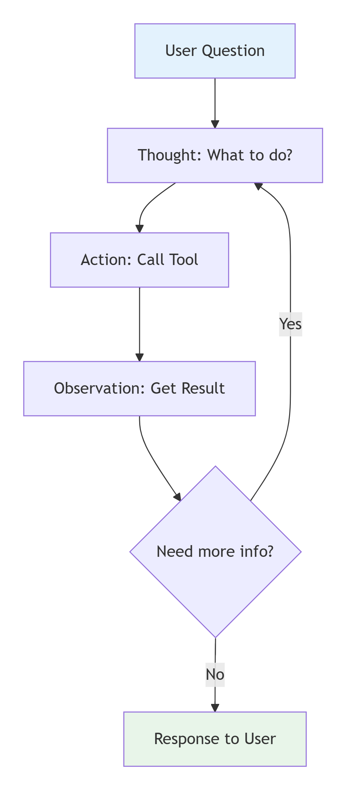

# 03 - Thiết kế AI Agent cho SDLC

## 🎯 Mục tiêu

Hướng dẫn thiết kế và triển khai AI Agent trong quy trình SDLC, tập trung vào **ReAct Pattern** và **Function Calling**.

---

## 🧠 ReAct Pattern

### Concept

**ReAct** = **Reason** (Lý luận) + **Act** (Hành động)

Agent liên tục thực hiện vòng lặp:
1. **Thought**: Suy nghĩ về vấn đề và xác định cần gì
2. **Action**: Quyết định hành động (gọi tool, query database,...)
3. **Observation**: Quan sát kết quả từ hành động
4. **Response**: Đưa ra phản hồi cuối cùng dựa trên observations

*Hình 1: Vòng lặp Reasoning và Acting trong AI Agent*

### Ví dụ ReAct Flow
Question: "Generate API for user login"

Thought: Need user model, JWT, password hashing
Action: Call code_gen_tool
Observation: Got code skeleton

Thought: Need to add validation
Action: Call security_tool
Observation: Got validation code

Thought: Need to add database integration
Action: Call db_tool
Observation: Got database schema

Thought: I now have all components
Response: Final complete code with validation and DB

---

## 🔧 Function Calling

### Concept

Function Calling cho phép AI model gọi các hàm (functions) được định nghĩa trước để lấy dữ liệu hoặc thực hiện hành động.

### Các tools thường dùng trong SDLC

#### 1. Code Generator Tool
- **Chức năng**: Sinh code từ mô tả
- **Hỗ trợ**: Nhiều ngôn ngữ, frameworks
- **Output**: Code hoàn chỉnh với documentation

#### 2. Code Review Tool
- **Chức năng**: Phân tích code quality
- **Phát hiện**: Bugs, security issues, anti-patterns
- **Output**: Báo cáo chi tiết với đề xuất fix

#### 3. Test Generator Tool
- **Chức năng**: Sinh unit tests, integration tests
- **Tạo**: Test data, mocks, stubs
- **Output**: Test suite với coverage >90%

#### 4. Documentation Tool
- **Chức năng**: Tạo và cập nhật documentation
- **Hỗ trợ**: Docstrings, API docs, README
- **Output**: Documentation đầy đủ và cập nhật

#### 5. Security Scanner Tool
- **Chức năng**: Vulnerability detection
- **Kiểm tra**: Best practices, compliance
- **Output**: Security report với severity

---

## 🤖 Các loại AI Agent

### 1. Reactive Agent (User-triggered)

**Đặc điểm**:
- Phản ứng khi user yêu cầu
- Xử lý từng query cụ thể
- Trả lời trực tiếp

**Ví dụ**:
- Chatbot hỗ trợ developer
- Code assistant
- Question answering

**Luồng hoạt động**:
User Query → Agent → Process → Response

### 2. Proactive Agent (Scheduled/Event-driven)

**Đặc điểm**:
- Tự động chạy theo lịch trình
- Không cần user trigger
- Cảnh báo và hành động chủ động

**Ví dụ**:
- Tự động review code hàng đêm
- Monitor system 24/7
- Auto-generate tests cho code mới

**Luồng hoạt động**:
Scheduler → Trigger → Agent → Analysis → Action/Alert

### 3. Collaborative Agent (Multi-agent System)

**Đặc điểm**:
- Nhiều agent phối hợp
- Mỗi agent chuyên biệt
- Workflow tự động hóa

**Ví dụ**:
- Architect Agent → Developer Agent → Tester Agent
- Workflow từ requirement đến deployment

**Luồng hoạt động**:
Requirement → Architect Agent → Design
→ Developer Agent → Code
→ Tester Agent → Tests
→ Reviewer Agent → Review

---

## 🎯 Advanced Agent Patterns

### 1. RAG (Retrieval-Augmented Generation)

**Mô tả**: Kết hợp retrieval và generation cho responses chính xác.

**Flow**:
1. User query
2. Search relevant documents (vector DB)
3. Retrieve context
4. Combine context + query
5. Generate response

**Ứng dụng**:
- Documentation search
- Codebase understanding
- Best practices lookup

### 2. Chain of Thought (CoT)

**Mô tả**: Agent suy nghĩ từng bước trước khi đưa ra câu trả lời.

**Flow**:
1. Phân tích vấn đề
2. Break down thành sub-problems
3. Giải quyết từng phần
4. Tổng hợp kết quả
5. Đưa ra giải pháp hoàn chỉnh

**Ứng dụng**:
- Complex problem solving
- Architecture design
- Debugging

### 3. Self-Correction

**Mô tả**: Agent tự kiểm tra và sửa lỗi.

**Flow**:
1. Generate output
2. Validate với rules và constraints
3. Phát hiện issues
4. Fix và regenerate
5. Lặp lại cho đến khi chất lượng đạt yêu cầu

**Ứng dụng**:
- Code generation với validation
- Test generation với coverage check
- Documentation với consistency check

---

## 📊 Performance Optimization

### 1. Caching

**Mô tả**: Lưu kết quả để tái sử dụng.

**Lợi ích**:
- Giảm latency
- Tiết kiệm cost
- Improve throughput

### 2. Batch Processing

**Mô tả**: Xử lý nhiều request cùng lúc.

**Lợi ích**:
- Efficient resource use
- Reduce API calls
- Better throughput

### 3. Parallel Processing

**Mô tả**: Xử lý đồng thời các tasks độc lập.

**Lợi ích**:
- Faster completion
- Better resource utilization
- Scale effectively

---

## 🔒 Security Best Practices

### 1. Input Sanitization
- Validate và clean user input
- Detect và block injection attempts
- Limit dangerous patterns

### 2. Output Filtering
- Filter sensitive information
- Remove harmful content
- Ensure compliance

### 3. Access Control
- Role-based access
- Least privilege principle
- Regular audits

### 4. Data Privacy
- Anonymize sensitive data
- Use local models
- Implement retention policies

---

## 📈 Monitoring & Evaluation

### Metrics to Track

1. **Performance Metrics**:
   - Response time
   - Throughput
   - Resource usage

2. **Quality Metrics**:
   - Accuracy
   - Consistency
   - User satisfaction

3. **Cost Metrics**:
   - API costs
   - Resource costs
   - ROI

4. **Usage Metrics**:
   - Request frequency
   - Popular tools
   - User engagement

### Continuous Improvement

1. Collect feedback
2. Analyze performance
3. Identify bottlenecks
4. Update and optimize
5. Repeat cycle