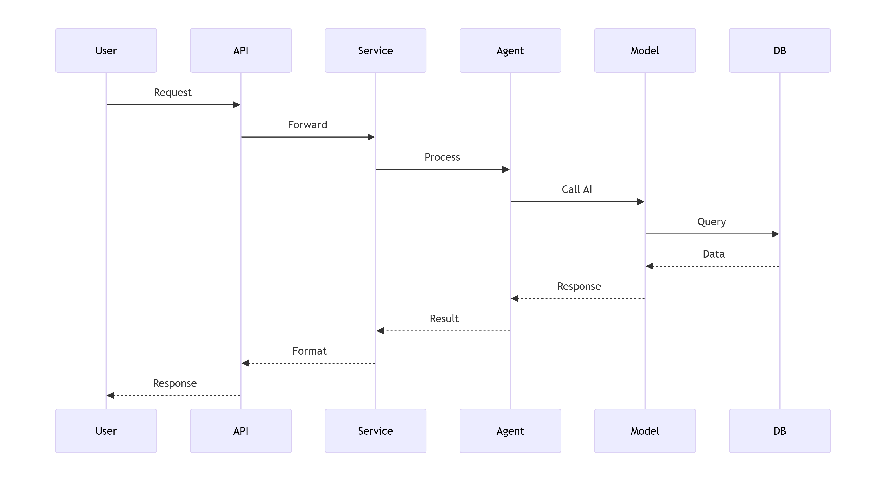
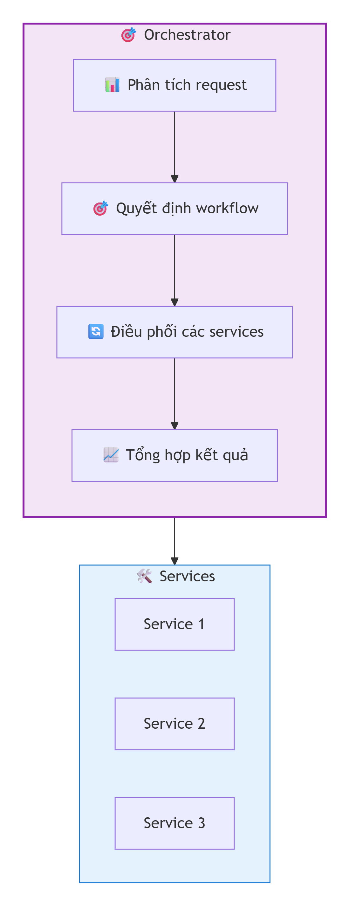
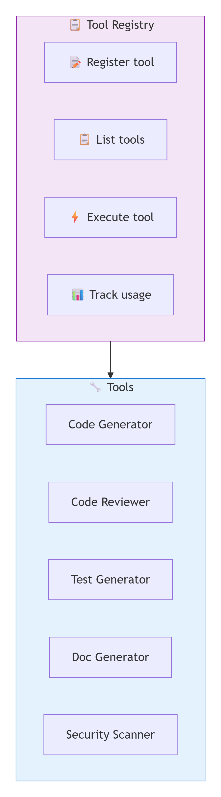
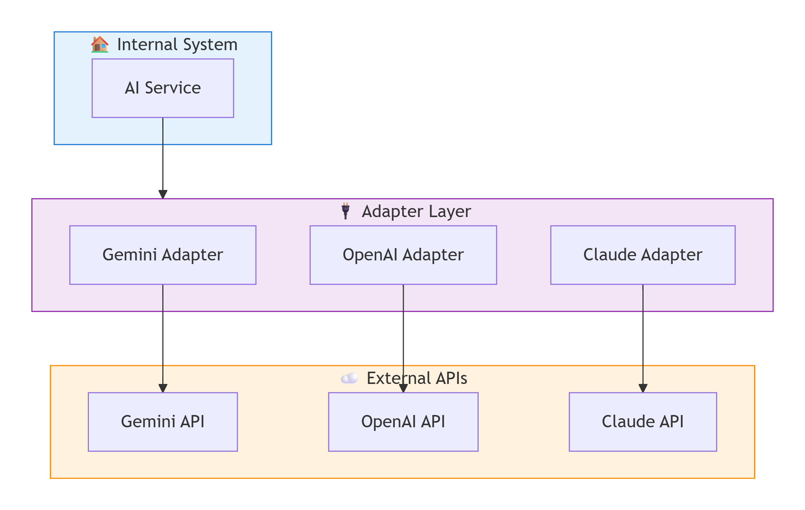
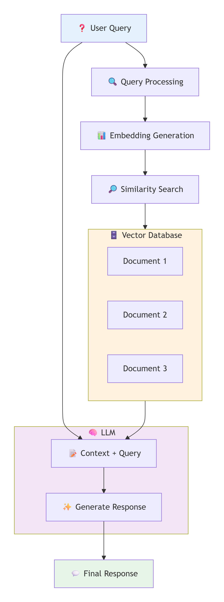
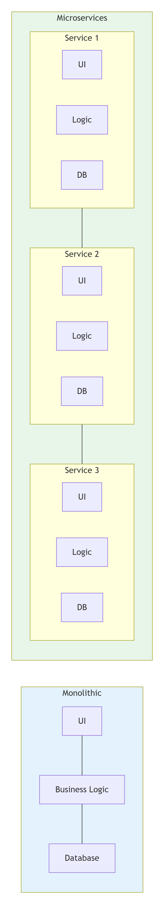
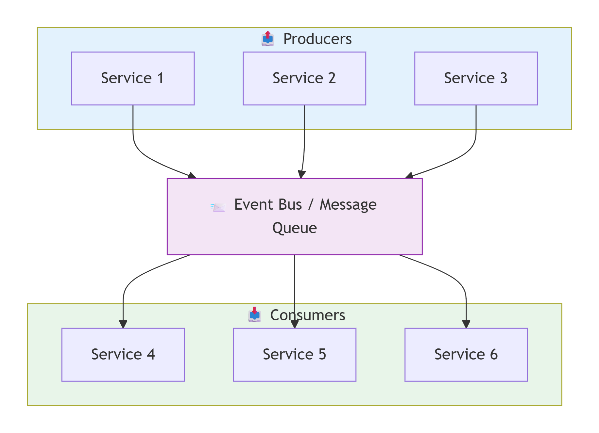
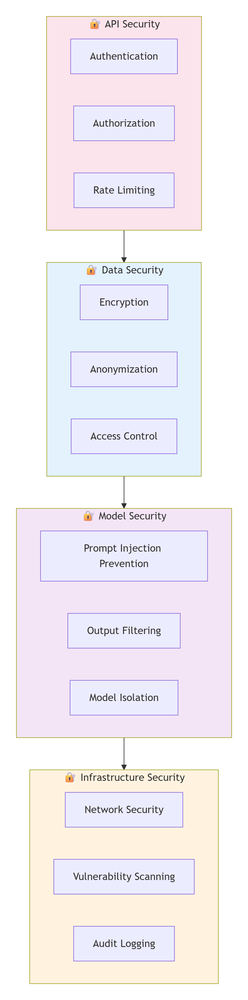
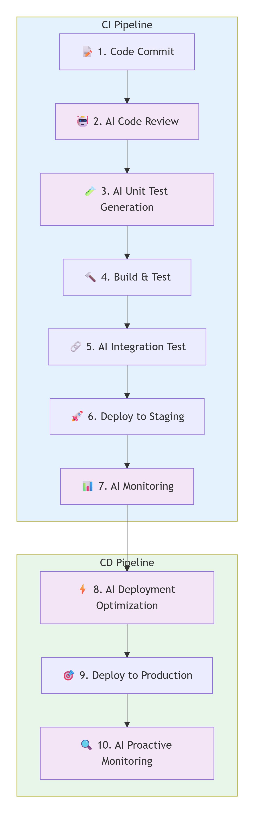
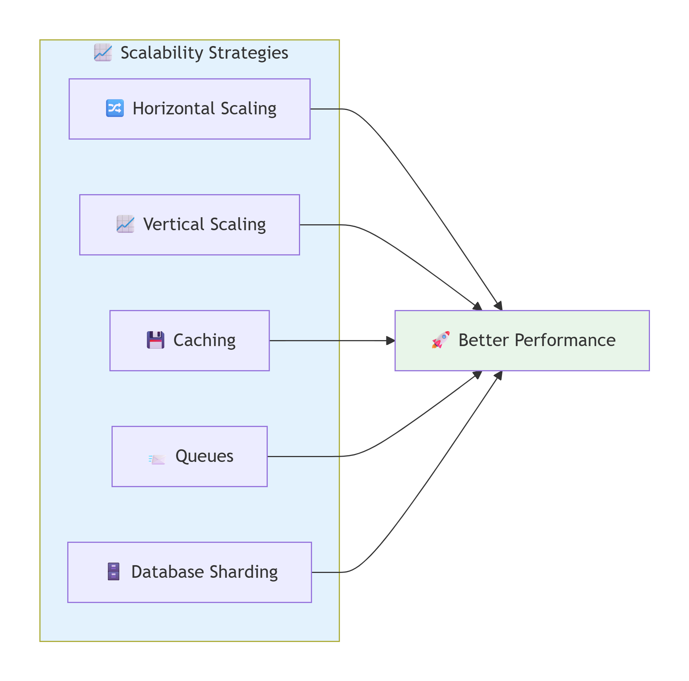

# 04 - Kiến trúc AI-Augmented SDLC

## 📌 Tổng quan

Tài liệu này mô tả kiến trúc tổng thể của hệ thống AI-Augmented SDLC, bao gồm các thành phần, interactions và patterns thiết kế.

---

## 🏗️ Kiến trúc tổng thể

*Hình 1: Kiến trúc các layer của AI-Augmented SDLC*

### Lớp kiến trúc (Architecture Layers)

| Layer | Thành phần | Chức năng |
|-------|-----------|-----------|
| **Presentation** | Web UI, API Gateway, CLI Tools | Giao diện người dùng và API endpoints |
| **Application** | Requirement, Code, Test, Review Services | Xử lý logic nghiệp vụ |
| **AI Agent** | Orchestrator, Tool Registry, Prompt Manager | Điều phối và quản lý AI |
| **Model** | Foundation Models, Fine-tuned Models | Xử lý AI/ML |
| **Data** | Code Repository, Database, Vector DB | Lưu trữ và truy xuất dữ liệu |

---

## 🔄 Luồng dữ liệu

*Hình 2: Luồng dữ liệu giữa các thành phần*

### Flow 1: Code Generation
User Request → API Gateway → Code Service
↓
AI Agent Orchestrator
↓
Tool: Code Generator
↓
AI Model (LLM)
↓
Generated Code + Explanation
↓
Code Review Service
↓
Human Review (Optional)
↓
Code Repository

### Flow 2: Proactive Monitoring
Scheduler → Trigger
↓
Proactive Agent
↓
Monitor Code/System
↓
Anomaly Detected?
↙ ↘
Yes No
↓ ↓
Alert Continue
↓
Analysis & Suggestion
↓
Send Notification

### Flow 3: Continuous Learning
User Feedback → Feedback Handler
↓
Performance Metrics
↓
Improvement Suggestions
↓
Update Prompts/Models
↓
Better Results

---

## 🎯 Design Patterns

### 1. Orchestrator Pattern

*Hình 3: Orchestrator Pattern điều phối các services*

**Mô tả**: Central orchestrator điều phối các services và agents.

**Chức năng chính**:

| Chức năng | Mô tả |
|-----------|-------|
| 📊 **Phân tích request** | Hiểu yêu cầu từ người dùng |
| 🎯 **Quyết định workflow** | Xác định các bước cần thực hiện |
| 🔄 **Điều phối services** | Gọi và phối hợp các services |
| 📈 **Tổng hợp kết quả** | Gom kết quả từ các services |

**Lợi ích**:
- Centralized control
- Dễ dàng debug và monitoring
- Consistent workflow management

---

### 2. Tool Registry Pattern

*Hình 4: Tool Registry quản lý các tools*

**Mô tả**: Registry chứa tất cả tools, được gọi thông qua API thống nhất.

**Chức năng chính**:

| Chức năng | Mô tả |
|-----------|-------|
| 📝 **Register tool** | Đăng ký tool mới |
| 📋 **List tools** | Liệt kê tất cả tools |
| ⚡ **Execute tool** | Thực thi tool |
| 📊 **Track usage** | Theo dõi usage |

**Các tools có sẵn**:

| Tool | Chức năng |
|------|-----------|
| 🔧 **Code Generator** | Sinh code từ mô tả |
| 🔍 **Code Reviewer** | Phân tích và đánh giá code |
| 🧪 **Test Generator** | Sinh unit tests và integration tests |
| 📝 **Documentation** | Tạo và cập nhật tài liệu |
| 🔒 **Security Scanner** | Phát hiện lỗ hổng bảo mật |

---

### 3. Adapter Pattern

*Hình 5: Adapter Pattern kết nối với external APIs*

**Mô tả**: Adapter để kết nối với external systems và APIs.

**Chức năng của Adapter**:

| Chức năng | Mô tả |
|-----------|-------|
| 🔄 **Convert request** | Chuyển đổi định dạng request |
| 🔑 **Handle authentication** | Xử lý xác thực API keys |
| 📊 **Process response** | Chuẩn hóa response từ các API khác nhau |
| 🛡️ **Error handling** | Xử lý lỗi và retry |

---

### 4. RAG Pattern (Retrieval-Augmented Generation)

*Hình 6: RAG Pattern kết hợp retrieval và generation*

**Mô tả**: Kết hợp retrieval và generation cho responses chính xác.

**Quy trình RAG**:

| Bước | Mô tả |
|------|-------|
| 1 | **User Query**: Người dùng đặt câu hỏi |
| 2 | **Embedding Generation**: Tạo vector embeddings |
| 3 | **Similarity Search**: Tìm kiếm documents liên quan |
| 4 | **Context + Query**: Kết hợp context và query |
| 5 | **Generate Response**: LLM sinh câu trả lời |

**Ứng dụng**:
- 📚 Documentation search
- 💻 Codebase understanding
- 📖 Best practices lookup

---

## 🏛️ So sánh các loại kiến trúc

### Monolithic vs Microservices

*Hình 7: So sánh Monolithic và Microservices*

| Đặc điểm | Monolithic | Microservices |
|----------|------------|---------------|
| **Ưu điểm** | Simple, easy to deploy | Scale độc lập, technology diversity |
| **Nhược điểm** | Khó scale, tight coupling | Complex, distributed complexity |
| **Khi nào dùng** | Small teams, early stage | Large teams, enterprise |
| **Deployment** | Single unit | Independent services |
| **Database** | Single database | Database per service |

### Event-Driven Architecture

*Hình 8: Event-Driven Architecture*

**Mô tả**: Components communicate through events.

**Lợi ích**:
- 🔗 **Loose coupling**: Các service không phụ thuộc trực tiếp
- ⚡ **Async processing**: Xử lý bất đồng bộ
- 📈 **Scalable**: Dễ dàng scale từng phần
- 🛡️ **Resilience**: Một service fail không ảnh hưởng toàn hệ thống

---

## 🛡️ Security Architecture

### Layers of Security

*Hình 9: Các lớp bảo mật trong hệ thống*

#### 1. API Security Layer

| Biện pháp | Mô tả | Ví dụ |
|-----------|-------|-------|
| 🔑 **Authentication** | Xác thực người dùng | JWT, OAuth2 |
| 🔐 **Authorization** | Phân quyền truy cập | RBAC, ABAC |
| ⏱️ **Rate Limiting** | Giới hạn request | 100 req/min per user |
| 🛡️ **CORS** | Bảo vệ cross-origin | Configured CORS policy |

#### 2. Data Security Layer

| Biện pháp | Mô tả | Ví dụ |
|-----------|-------|-------|
| 🔒 **Encryption** | Mã hóa dữ liệu | AES-256, TLS 1.3 |
| 🕵️ **Anonymization** | Ẩn danh dữ liệu | Remove PII |
| 🚫 **Access Control** | Kiểm soát truy cập | Row-level security |
| 💾 **Backup** | Sao lưu dữ liệu | Daily automated backup |

#### 3. Model Security Layer

| Biện pháp | Mô tả | Ví dụ |
|-----------|-------|-------|
| 🛡️ **Prompt Injection Prevention** | Ngăn chặn injection | Input sanitization |
| 🔍 **Output Filtering** | Lọc đầu ra | Remove harmful content |
| 📦 **Model Isolation** | Cô lập models | Containerization |
| 📊 **Model Monitoring** | Giám sát models | Detect anomalies |

#### 4. Infrastructure Security Layer

| Biện pháp | Mô tả | Ví dụ |
|-----------|-------|-------|
| 🌐 **Network Security** | Bảo vệ network | Firewall, VPC |
| 🔍 **Vulnerability Scanning** | Quét lỗ hổng | Weekly scans |
| 📝 **Audit Logging** | Ghi log kiểm tra | All actions logged |
| 🚨 **Alerting** | Cảnh báo sự cố | Real-time alerts |

---

## 🔄 CI/CD với AI-Augmented SDLC

*Hình 10: CI/CD Pipeline tích hợp AI*

### Pipeline với AI Integration

*Hình 11: Chi tiết CI/CD Pipeline với AI*

**CI Pipeline (7 bước):**

| Bước | Tác vụ | AI Role |
|------|--------|---------|
| 1 | **Code Commit** | Developer push code |
| 2 | **AI Code Review** | 🤖 Security scan, quality check |
| 3 | **AI Unit Test Generation** | 🤖 Tự động sinh unit tests |
| 4 | **Build & Test** | Build và chạy tests |
| 5 | **AI Integration Test** | 🤖 Sinh integration tests |
| 6 | **Deploy to Staging** | Triển khai lên staging |
| 7 | **AI Monitoring** | 🤖 Giám sát và validation |

**CD Pipeline (3 bước):**

| Bước | Tác vụ | AI Role |
|------|--------|---------|
| 8 | **AI Deployment Optimization** | 🤖 Tối ưu resource và config |
| 9 | **Deploy to Production** | Triển khai lên production |
| 10 | **AI Proactive Monitoring** | 🤖 Giám sát, phát hiện lỗi, auto-remediation |

---

## 📊 Performance & Scalability

### Performance Considerations

| Aspect | Consideration | Solution |
|--------|--------------|----------|
| **Latency** | AI calls can be slow | Async processing, caching |
| **Throughput** | Many concurrent requests | Load balancing, queues |
| **Resource Usage** | GPU/CPU intensive | Optimization, scheduling |
| **Cost** | API calls expensive | Caching, batch processing |

### Scalability Strategies

*Hình 12: Chiến lược mở rộng hệ thống*

| Strategy | Mô tả | Khi nào dùng |
|----------|-------|--------------|
| **Horizontal Scaling** | Thêm nhiều instances | Khi traffic tăng cao |
| **Vertical Scaling** | Nâng cấp resources | Khi cần performance cao |
| **Caching** | Lưu kết quả tạm | Khi có nhiều request giống nhau |
| **Queues** | Hàng đợi xử lý | Khi cần async processing |
| **Database Sharding** | Phân chia database | Khi dữ liệu lớn |

---

## 📂 Cấu trúc dự án

*Hình 13: Cấu trúc thư mục dự án*

### Giải thích cấu trúc

| Thư mục/File | Mô tả |
|--------------|-------|
| **README.md** | Tài liệu chính của dự án |
| **.env.example** | Mẫu cấu hình environment variables |
| **docs/** | Tài liệu chi tiết |
| **docs/images/** | Hình ảnh và sơ đồ |
| **docs/01-overview.md** | Tổng quan về AI-Augmented SDLC |
| **docs/02-phases.md** | Các phase của SDLC |
| **docs/03-ai-agent-design.md** | Thiết kế AI Agent |
| **docs/04-architecture.md** | Kiến trúc hệ thống |
| **docs/05-best-practices.md** | Best practices |
| **examples/** | Code mẫu |
| **templates/** | Template files |
| **static/** | Static assets |

---

## 📝 Best Practices cho Kiến trúc

### 1. Start Simple
- Bắt đầu với monolithic
- Use simple patterns
- Avoid over-engineering
- Iterate và evolve

### 2. Decouple Components
- Loose coupling
- Clean interfaces
- Event-driven khi cần

### 3. Plan for Failure
- Resilience patterns
- Retry và fallback
- Graceful degradation

### 4. Monitor Everything
- Metrics và logs
- Alerting
- Observability

### 5. Security First
- Security by design
- Regular audits
- Least privilege

### 6. Document Architecture
- Architecture decisions
- Runbooks
- Diagrams

---

## 🎯 Kết luận

Kiến trúc AI-Augmented SDLC được thiết kế để:

✅ **Tích hợp AI** một cách seamless vào quy trình phát triển
✅ **Tăng cường** năng lực của developer và team
✅ **Tự động hóa** các tác vụ lặp đi lặp lại
✅ **Đảm bảo** tính mở rộng và bảo mật

Với các design patterns và best practices, bạn có thể xây dựng một hệ thống mạnh mẽ và bền vững.