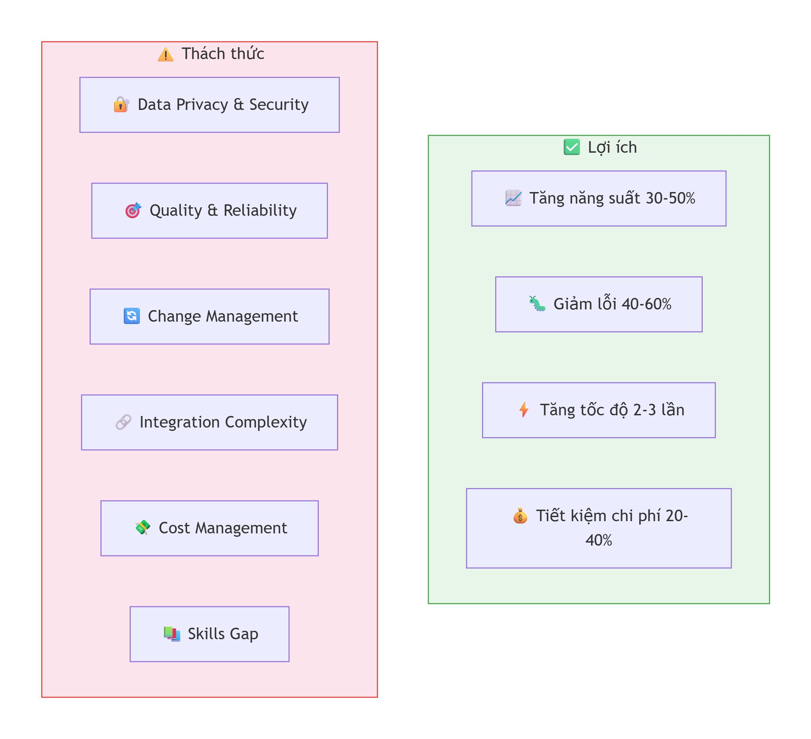

# 05 - Best Practices và Kinh nghiệm thực tế

## 🎯 Mục tiêu

Tổng hợp các best practices, bài học kinh nghiệm và pitfalls khi áp dụng AI-Augmented SDLC.

*Hình 1: Cân bằng giữa lợi ích và thách thức*

---

## 📋 Best Practices theo từng giai đoạn

### 1. Requirements & Planning

#### ✅ NÊN LÀM

1. **Start with clear objectives**:
   - Xác định rõ vấn đề cần giải quyết
   - Define success metrics cụ thể
   - Prioritize use cases

2. **Involve stakeholders early**:
   - Đưa dev, QA, DevOps vào từ đầu
   - Collect feedback định kỳ
   - Manage expectations

3. **Start small and iterate**:
   - Pilot với 1-2 use cases
   - Measure và learn
   - Scale gradually

#### ❌ KHÔNG NÊN LÀM

1. **Không áp dụng AI cho mọi thứ**: Không phải tất cả đều cần AI
2. **Không bỏ qua human review**: AI chưa hoàn hảo
3. **Không thiếu kế hoạch rollback**: Luôn có fallback plan
4. **Không bỏ qua security**: AI có thể là vector attack mới

---

### 2. AI Selection & Implementation

#### ✅ NÊN LÀM

1. **Choose right AI model**:
   - Evaluate multiple models
   - Consider cost vs performance
   - Test on your specific use cases

2. **Fine-tune for your domain**:
   - Use domain-specific data
   - Customize prompts
   - Iterate based on results

3. **Implement proper monitoring**:
   - Track performance metrics
   - Monitor API costs
   - Measure ROI

#### ❌ KHÔNG NÊN LÀM

1. **Không dùng model chưa test** trên production
2. **Không bỏ qua prompt engineering**: Prompt tốt = kết quả tốt
3. **Không ignore ethical considerations**

---

### 3. Development & Integration

#### ✅ NÊN LÀM

1. **Use version control**:
   - Track prompt versions
   - Version AI models
   - Document changes

2. **Implement proper error handling**:
   - Handle AI failures gracefully
   - Retry với exponential backoff
   - Fallback to manual

3. **Ensure reproducibility**:
   - Seed management
   - Consistent environments
   - Test with same inputs

#### ❌ KHÔNG NÊN LÀM

1. **Không assume AI always correct**
2. **Không quên testing AI-generated content**
3. **Không bỏ qua performance optimization**

---

### 4. Testing & Quality Assurance

#### ✅ NÊN LÀM

1. **Test AI outputs**:
   - Unit tests cho generated code
   - Validate AI responses
   - Edge cases testing

2. **Implement quality gates**:
   - Minimum accuracy threshold
   - Code quality checks
   - Security scanning

3. **User acceptance testing**:
   - Real user testing
   - Collect feedback
   - Iterate

#### ❌ KHÔNG NÊN LÀM

1. **Không trust AI blindly**
2. **Không bỏ qua manual testing**
3. **Không skip regression testing**

---

### 5. Deployment & Operations

#### ✅ NÊN LÀM

1. **Implement gradual rollout**:
   - Canary deployment
   - A/B testing
   - Feature flags

2. **Monitor in production**:
   - Performance monitoring
   - Error tracking
   - User feedback

3. **Have rollback plan**:
   - Quick rollback
   - Fallback to manual
   - Disaster recovery

#### ❌ KHÔNG NÊN LÀM

1. **Không deploy without monitoring**
2. **Không bỏ qua cost management**
3. **Không ignore user feedback**

---

## 💡 Bài học kinh nghiệm từ thực tế

### Lesson 1: AI không thay thế được hoàn toàn

**Tình huống**: Một team thử áp dụng AI để viết toàn bộ code, kết quả thất bại.

**Bài học**:
- AI cần human supervision
- AI tốt nhất cho tasks có tính lặp lại
- Con người vẫn cần cho creative và complex tasks

**Giải pháp**:
- 70% AI-assisted, 30% human-reviewed
- Build proper review process
- Focus AI trên repetitive tasks

---

### Lesson 2: Prompt Engineering rất quan trọng

**Tình huống**: Kết quả AI không tốt vì prompt không rõ ràng.

**Bài học**:
- Prompt tốt = kết quả tốt
- Need iterative improvement
- Domain knowledge quan trọng

**Giải pháp**:
- Invest time in prompt engineering
- A/B test prompts
- Learn from mistakes

---

### Lesson 3: Security không được bỏ qua

**Tình huống**: AI-generated code chứa security vulnerability.

**Bài học**:
- AI không perfect
- Security scanning mandatory
- Human review essential

**Giải pháp**:
- Automated security scanning
- Security training cho AI
- Human review for security

---

### Lesson 4: Cost management quan trọng

**Tình huống**: API costs skyrocket khi scale lên.

**Bài học**:
- AI costs có thể cao
- Need monitoring và optimization
- Caching giúp giảm cost

**Giải pháp**:
- Cache responses
- Optimize prompts
- Monitor costs daily

---

### Lesson 5: Training và adoption là key

**Tình huống**: Team không sử dụng AI tools.

**Bài học**:
- Need training và support
- Show value early
- Champions giúp adoption

**Giải pháp**:
- Training workshops
- Success stories sharing
- Incentivize adoption

---

## 🎯 Success Metrics và Measurement

### Các metrics cần theo dõi

| Metric | How to measure | Target |
|--------|----------------|--------|
| **Productivity** | Time saved, tasks completed | +30% |
| **Code Quality** | SonarQube score, bugs | +25% |
| **Developer Satisfaction** | Survey | >8/10 |
| **Cost Efficiency** | Cost per feature | -20% |
| **Time to Market** | Sprint completion | -40% |
| **User Satisfaction** | NPS, feedback | +20 points |

### Continuous Improvement Cycle

1. **Collect data**: Metrics và feedback
2. **Analyze**: Phân tích hiệu quả
3. **Learn**: Identify improvements
4. **Implement**: Update prompts/models
5. **Repeat**: Continue cycle

---

## 🚀 Lộ trình adoption cho team

### Phase 1: Awareness (1-2 weeks)
- Workshop về AI-Augmented SDLC
- Demo các tools
- Set expectations

### Phase 2: Pilot (1-2 months)
- Chọn 1-2 use cases
- Small team adoption
- Collect feedback

### Phase 3: Expansion (2-3 months)
- Mở rộng sang nhiều team
- Integrate vào workflow
- Training và support

### Phase 4: Optimization (3-6 months)
- Fine-tune prompts
- Measure ROI
- Scale adoption

### Phase 5: Full Integration (6-12 months)
- All teams using AI
- Continuous improvement
- Innovation và expansion

---

## ⚠️ Pitfalls thường gặp

### 1. Over-reliance on AI
- **Vấn đề**: Tin AI quá mức
- **Giải pháp**: Luôn có human review

### 2. Insufficient testing
- **Vấn đề**: Không test AI outputs
- **Giải pháp**: Automated và manual testing

### 3. Poor prompt engineering
- **Vấn đề**: Prompts không hiệu quả
- **Giải pháp**: Iterative improvement

### 4. Ignoring security
- **Vấn đề**: Security vulnerabilities
- **Giải pháp**: Security scanning and review

### 5. Cost explosion
- **Vấn đề**: API costs quá cao
- **Giải pháp**: Caching và optimization

### 6. Resistance to change
- **Vấn đề**: Team không muốn đổi mới
- **Giải pháp**: Training và show value

---

## 📚 Resources và References

### Books
1. **"AI Engineering"** - Chip Huyen
2. **"Human-Centered AI"** - Ben Shneiderman
3. **"The DevOps Handbook"** - Gene Kim
4. **"Software Engineering for AI"** - Bjarne Stroustrup

### Articles
1. **"AI in Software Development"** - Martin Fowler
2. **"Prompt Engineering Guide"** - OpenAI
3. **"AI-Augmented Development"** - GitHub Blog
4. **"Future of DevOps with AI"** - AWS Blog

### Courses
1. **"AI for Everyone"** - Andrew Ng (Coursera)
2. **"Machine Learning"** - Stanford (Coursera)
3. **"DevOps with AI"** - LinkedIn Learning
4. **"Prompt Engineering"** - DeepLearning.AI

### Communities
1. **AI in Dev** - Discord/Reddit
2. **DevOps AI** - LinkedIn Groups
3. **AI Engineering** - GitHub Discussions